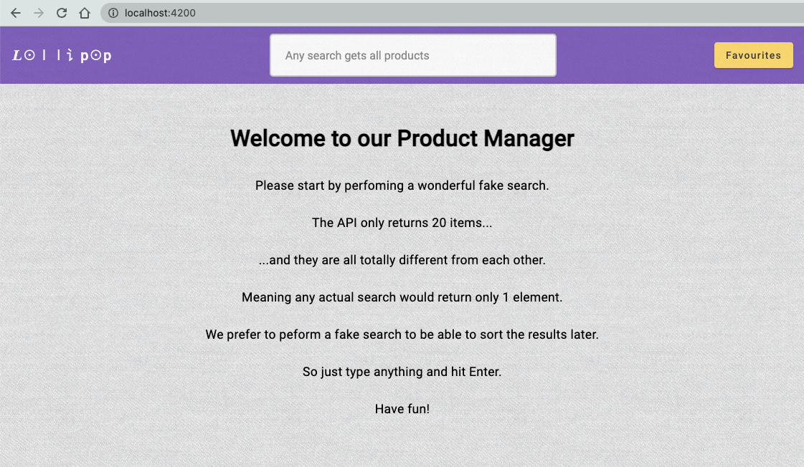

# Wallapop Tech Assessment

This project was generated with [Angular CLI](https://github.com/angular/angular-cli) version 15.0.2.

## Development server

Run `ng start` for a dev server. Navigate to `http://localhost:4200/`. The application will automatically reload if you change any of the source files.

## Interaction

The first step is explained in the content of the home page.

 

 

Recommended further steps are the ones written in the e2e test.

## App features

When you navigate to products, you can:

- Perform another fake search.
- Sort products.
- Add or remove products to your favourites list by clicking on the item star.
- Navigate to next and previous pages.
- Click on Favourites button (top left) and visualize the list of your favourite products.
- In the modal dialog you can also remove items from the list.

## Build

Run `ng build` to build the project. The build artifacts will be stored in the `dist/` directory.

## Running unit tests

Run `npm t` to execute the unit tests via [Jest](https://jestjs.io/).

## Running end-to-end tests

Run `npm run e2e:run` to execute the end-to-end tests via [Cypress](https://www.cypress.io/).
